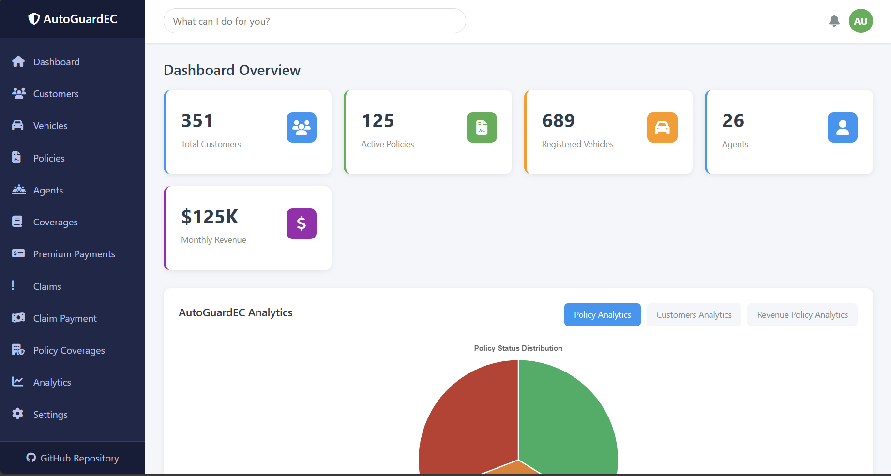
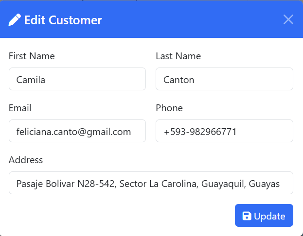

# 🚗 AutoGuardEC  
**Your peace of mind every mile.**  
_A modern auto insurance management system designed for the Ecuadorian market._

---

## 🧩 Overview
**AutoGuardEC** is a comprehensive **vehicle insurance management platform** that allows users, agents, and administrators to interact with policies, customers, and claims through a centralized dashboard. It was designed to optimize insurance workflows for the **Ecuadorian automotive sector**, combining **data-driven insights**, **secure storage**, and **intuitive interfaces**.

---

## ✨ Key Features
- 🧾 **Policy Management:** Create, update, and track insurance policies.  
- 👥 **Customer Records:** Manage client data with relational database integrity.  
- ⚙️ **Claims Handling:** Log, review, and approve claims efficiently.  
- 📊 **Analytics Dashboard:** Interactive charts and metrics using Flask + Chart.js.  
- 🔐 **Secure Access:** Role-based login for customers, employees, and admins.  
- 🇪🇨 **Localized Design:** Built for Ecuador's auto insurance standards and workflows.

---

## 🏗️ System Architecture
```mermaid
graph TD
    Client[Frontend (Bootstrap 5 / HTML / JS)] -->|REST API| Server[Backend (Flask)]
    Server -->|SQLAlchemy ORM| DB[(Database MySQL 8)]
```

---

## ⚙️ Tech Stack
| Layer | Technology |
|-------|-------------|
| **Backend** | Python 3.10+, Flask, Flask-SQLAlchemy |
| **Database** | MySQL 8 (Dockerized) |
| **Frontend** | HTML5, CSS3, Bootstrap 5, Chart.js |
| **Containerization** | Docker, Docker Compose |
| **Tools** | VS Code, Postman, GitHub |

---

## 🧰 Installation & Setup

You can run AutoGuardEC using **Docker Compose** (recommended) or set it up **locally** for development.

### Option 1: 🐳 Run with Docker Compose (Recommended)
This method sets up both the application and the database in containers.

1. **Clone the repository**
   ```bash
   git clone https://github.com/brdenky/AutoGuardEC.git
   cd AutoGuardEC
   ```

2. **Start the services**
   ```bash
   docker-compose up --build
   ```
   - The database will be initialized with `CarInsuranceDB`.
   - The web app will start on port `5000`.

3. **Access the application**
   Open [http://localhost:5000](http://localhost:5000) in your browser.

---

### Option 2: 🔧 Local Development
Run the Flask application locally while hosting the database in Docker.

1. **Clone and Setup Python Environment**
   ```bash
   git clone https://github.com/brdenky/AutoGuardEC.git
   cd AutoGuardEC
   python -m venv venv
   
   # Activate Virtual Environment
   # Windows:
   venv\Scripts\activate
   # Linux/Mac:
   source venv/bin/activate
   ```

2. **Install Dependencies**
   ```bash
   pip install -r requirements.txt
   ```

3. **Start the Database**
   Use Docker Compose to start only the database service.
   ```bash
   docker-compose up -d db
   ```
   *This exposes MySQL on `localhost:3308`.*

4. **Configure Environment**
   Create a `.env` file in the project root logic (optional, as defaults are set in `config.py`):
   ```env
   FLASK_APP=app.py
   FLASK_ENV=development
   # Database Configuration (Matches docker-compose.yml ports)
   DB_HOST=localhost
   DB_PORT=3308
   DB_USER=root
   DB_PASSWORD=123
   DB_NAME=CarInsuranceDB
   ```

5. **Run the Application**
   ```bash
   flask run
   ```
   Access at [http://localhost:5000](http://localhost:5000).

---

## 📡 Example API Endpoints
| Method   | Endpoint          | Description                     |
| -------- | ----------------- | ------------------------------- |
| `GET`    | `/policies`       | Retrieve all insurance policies |
| `POST`   | `/customers`      | Add a new customer              |
| `PUT`    | `/claims/<id>`    | Update claim status             |
| `DELETE` | `/employees/<id>` | Remove employee record          |

---

## 📊 Dashboard Preview
### Main View


### Main Dashboard


### Entity Management


### Forms (Add/Edit)



### Reports


---

## 🧪 Testing
Run unit tests with:
```bash
pytest
```
Or use the Postman collection available in `/tests/postman_collection.json`.

---

## 🧑‍💻 Authors

**Mateo Pilaquinga**  
Computer Science Student – Yachay Tech University  
📧 mateo.pilaquinga@yachaytech.edu.ec  
🌐 [LinkedIn](https://linkedin.com/in/pilaquinga-mateo)

**Harolt Farinango**  
Computer Science Student – Yachay Tech University  
📧 harolt.farinango@yachaytech.edu.ec  
🌐 [LinkedIn](https://linkedin.com/in/harolt-farinango)

---

## 🏁 Future Improvements
- [ ] Integrate JWT Authentication for role-based access
- [ ] Add email notifications for policy renewals
- [ ] Implement OCR for automatic claim document scanning
- [ ] Deploy to AWS EC2 with Nginx reverse proxy

---

## 📜 License
This project is licensed under the MIT License – see the [LICENSE](LICENSE) file for details.

---
  
**Made with ❤️ by the AutoGuardEC Team**  
🚗 *Your peace of mind every mile.*
